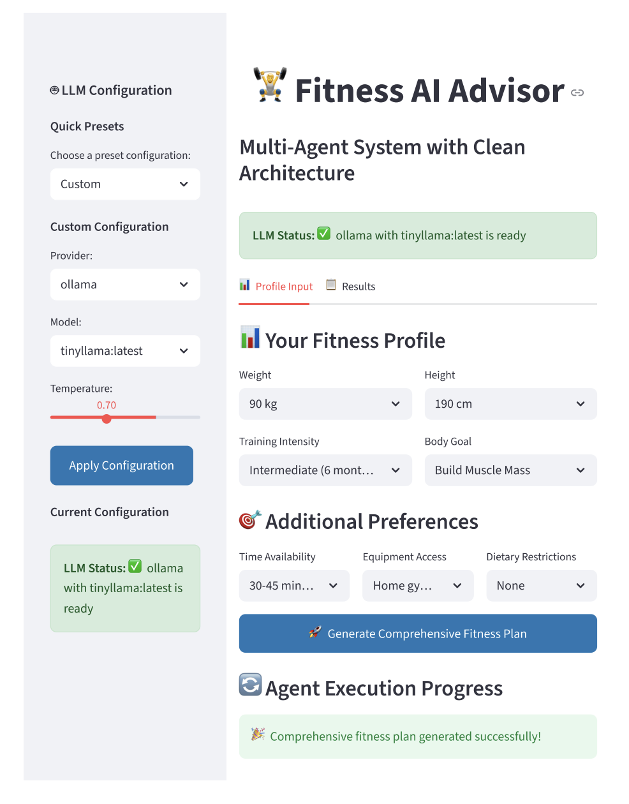

# 💪 Fitness AI Advisor

## 🎯 Project Summary

I've created a sophisticated **LangGraph-based multi-agent system** for fitness recommendations that uses a **supervisor architecture** with three specialized AI agents. This system provides comprehensive, personalized fitness, nutrition, and cooking advice based on user preferences.

## Interface



## 🏗️ System Architecture

```
User Input → Training Specialist → Nutrition Specialist → Cooking Specialist → Supervisor → Final Plan
```

### 🤖 Agent Hierarchy

1. **🏋️ Training Specialist**
   - **Role**: Expert fitness trainer and strength coach
   - **Expertise**: Workout planning, exercise selection, progression strategies
   - **Output**: Detailed training program with sets, reps, frequency

2. **🍎 Nutrition Specialist**
   - **Role**: Certified sports nutritionist and registered dietitian
   - **Expertise**: Caloric needs, macronutrient optimization, meal timing
   - **Output**: Personalized nutrition plan with specific targets

3. **👨‍🍳 Cooking Specialist**
   - **Role**: Culinary expert and meal prep specialist
   - **Expertise**: Recipe development, meal prep strategies, cooking techniques
   - **Output**: Practical cooking advice and meal preparation plans

4. **👨‍💼 Supervisor**
   - **Role**: Senior fitness and wellness coordinator
   - **Expertise**: Coordination, integration, conflict resolution
   - **Output**: Comprehensive, actionable fitness plan

## 🚀 Key Features

### Multi-Agent System
- **Specialized Agents**: Training, nutrition, and cooking specialists
- **Supervisor Coordination**: Conflict resolution, integration of outputs
- **Modular LLM Configuration**: Easily switch between different LLM providers and models

## Quick Start

### Using UV (Recommended) - Auto-creates .venv!

UV automatically creates and manages the virtual environment for you!

```bash
# One command setup (creates .venv, installs everything)
./setup.sh

# Or manually:
make install-dev    # UV auto-creates .venv and installs deps

# Run the app (UV auto-activates .venv)
make run
```

### Using pip (Alternative)

```bash
python -m venv .venv
source .venv/bin/activate
pip install -r requirements.txt
streamlit run app.py
```

The app will open in your browser at `http://localhost:8501`

### Development Commands

UV handles the virtual environment automatically - no need to activate!

```bash
make install-dev   # Install with dev tools (auto-creates .venv)
make lint          # Check code with ruff
make format        # Format code with ruff
make check         # Lint and auto-fix issues
make test          # Run tests
make run           # Run the application
make clean         # Clean cache and .venv
```

### How UV Works

UV automatically:
- ✅ Creates `.venv` if it doesn't exist
- ✅ Activates the venv for each command
- ✅ Installs dependencies from `pyproject.toml`
- ✅ Locks dependencies for reproducibility

**No manual venv activation needed!** Just use `uv run <command>` or `make` commands.

## How to Use

1. **Select Your Profile**: Choose your weight, training intensity, height, and body goal from the dropdown menus
2. **Get AI Recommendations**: Click the "Get AI Recommendations" button
3. **Review Results**: View your personalized fitness plan and nutrition guidelines
4. **Download**: Save your recommendations for offline reference

## Contributing

Feel free to submit issues and enhancement requests!

## License

MIT License - feel free to use this project for your own applications. 